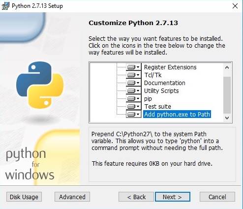

=======
Windows
=======

Requirements
============

- `Python 2.7.13 x86-64 MSI Installer <https://www.python.org/downloads/release/python-2713>`_
- `Microsoft Visual C++ Compiler for Python 2.7 <http://aka.ms/vcpython27>`_
- `Git for Windows <https://git-for-windows.github.io>`_

Installing Python
-----------------
- Choose either *Install for all users* or *Install just for me*.
- On the installer's "Customize Python 2.7.13 (64-bit)" page, scroll down and click on the option to ``Add python.exe to Path``.

After installing, make sure ``python.exe`` is in your PATH.

To test if it is in your PATH, type "python" and hit Return; if you see a message
``'python' is not recognized as an internal or external command, operable program or batch file``
then it is not in your PATH and you may have to restart Windows.

You can add it to your PATH manually with the command ``PATH=$PATH;c:\Python27``.

Installing Git
--------------

- Use the default choices on all the installer questions.

You may have to restart Windows for git.exe to appear in your PATH.

To add it to your PATH manually, use the command:

.. code-block:: bat

   PATH=$PATH;c:\Program Files\Git\bin

Installing VirtualEnv
---------------------

- Open PowerShell and install ``virtualenv``.

You may have to use the command ``PATH=$PATH;c:\python27\scripts`` for pip.exe to appear in your PATH

.. code-block:: bat

    C:\Users\foo> pip install virtualenv

Installing Plone
================

Get started by cloning this repository.

.. code-block:: bat

   C:\Users\foo> git clone https://github.com/plone/simple-plone-buildout

Copy the ``buildout.cfg_tmpl`` into the buildout root.

The ``profiles/testing.cfg`` profile is active by default, but you can use any of the :doc:`others <working_with_buildout>`.

.. code-block:: bat

   C:\Users\foo> cd simple-plone-buildout

   C:\Users\foo\simple-plone-buildout> copy profiles\buildout.cfg.tmpl buildout.cfg

Create an *env* directory with a virtual environment:

.. code-block:: bat

   C:\Users\foo\simple-plone-buildout> virtualenv env

Install ``zc.buildout`` and ``setuptools`` according to requirements.txt

.. code-block:: bat

   C:\Users\foo\simple-plone-buildout> env\Scripts\pip install -r requirements.txt

Create an instance:

.. code-block:: bat

   C:\Users\foo\simple-plone-buildout> env\Scripts\buildout

**Do not** be alarmed if you see the following:

.. code-block:: python

   SyntaxError: 'return' outside function

**Ignore** ``SyntaxErrors`` that scroll by while you enjoy your coffee.

This will download Plone's eggs and modules for you, as well as other dependencies and create a new Plone instance.

You can start your Plone instance by running:

.. code-block:: bat

   C:\Users\foo\simple-plone-buildout> bin\instance fg

Or, to run in background mode:

.. code-block:: bat

   C:\Users\foo\simple-plone-buildout> bin\instance start

Navigate your browser to `<http://localhost:8080>`_.

The initial user is **admin** with **admin** as the password.
